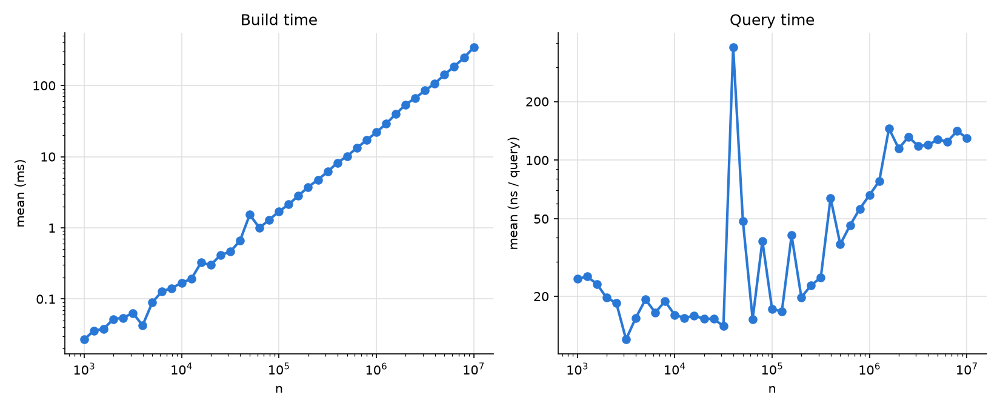
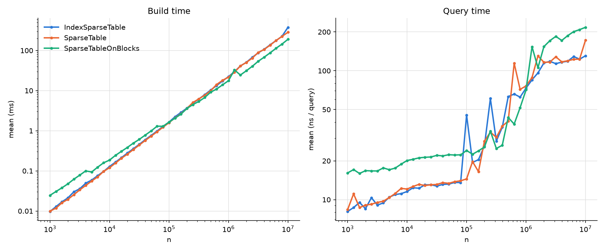

# Experiments on sparse tables

## Problem

Given an array of u64 I want to build a sparse table on it and optimize its runtime/space performance.

## Benchmarking

I first need to setup proper benchmarking. The goal is to run increasingly large benchmarks and track data structure size and query time.

For now I will simply write the main function to run the benchmarks, so I can control their execution independently of any frameworks.

### Initial results on Offset Sparse Table

The results are noisy and only exist for one version of the sparse table. Next I want to add support for comparing multiple tables.

### Allowing comparison of table versions first

The results remain somewhat noisy. Unsurprisingly the IndexSparseTable and OffsetSparseTable have very similar performance, since the latter doesn't yet use bitpacking.

## Sparse Table improvements

### Bitpacking offsets

We can utilize the fact that we are storing offsets and not indices, by storing them in a packed vector instead of always using the full 64 bits to store an offset